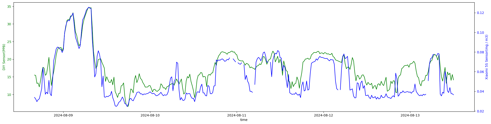

<p align="center">
  
</p>

该仓库主要用来放一些 Sensiron SFA30 传感器 DIY 的内容，完整的甲醛笔记请参考[城璐的甲醛狩猎笔记（还未完成）](https://chenglu.me/blogs/hcho-bill)。

# 🏁 小米 5S 传感器和 SFA30 传感器的对比

> 因为没有独立供电，SFA 30 的位置比较受限，这次测试 SFA 30 距离 5S 还是挺远的，而且 SFA 30 要靠近窗户一些。等后续借个充电宝，再将板子和小米 5S 放在同一个地方再做个对比。

小米 5S 净化器接入了 Home Assistant，由 Home Assistant 采集，每 5 分钟一次，[查看文件](./xiaomi5s-vs-sensiron-sfa30/xiaomi5s.csv)。

自制的 Sensiron SFA30 传感器每 10 秒钟主动推送数据到一个 HTTP Server，[查看文件](./xiaomi5s-vs-sensiron-sfa30/sfa30.txt)。

[[绘图源码]](./xiaomi5s-vs-sensiron-sfa30/code.ipynb)

两份数据都取 `2024-08-08 16:00:00` 到 `2024-08-13 12:00:00` 的部分，然后每隔 20 分钟取均值，将得到的数据绘制在同一个图中，效果如下（注意两边的单位不一样，小米 5S 的单位是 `ug/m3`，SFA30 的单位是 `ppb`）：



虽然位置离得远而且单位不同，但单就这个图来看，两者的数据还是很接近的。

# 🛠️ 板子开发

板子是淘宝购买的带 WiFI 蓝牙模块的 esp32 Arduino，SFA30 传感器也是淘宝购买的，两者通过 I2C 连接。如何连接可以直接参考 SFA30 的[官方文档](https://sensirion.com/media/documents/DEB1C6D6/63D92360/Sensirion_formaldehyde_sensors_datasheet_SFA30.pdf)。

> 官方其实更推荐 UART 连接，但我尝试了 UART，无法获取数据，只有 I2C 可以成功获取到数据。

板子开发使用 Arduino，需要下载 [Sensirion I2C SFA3X Arduino Library](https://github.com/Sensirion/arduino-i2c-sfa3x)，也可以直接用官方提供的[例子代码](https://github.com/Sensirion/arduino-snippets/blob/main/SFA30_I2C_minimal_example/SFA30_I2C_minimal_example.ino)。Sensiron 的开发者支持可以说做得非常到位 👍，所有事情基本都可以直接参考官方文档。

代码逻辑很简单：从板子中读出数据，然后直接通过 HTTP 发送到一个 HTTP Server 上。然后在 HTTP Server 做后续处理。板子上只需要做读数据和发送请求两件事。作为完全不懂嵌入式的小白一枚，用 GPT 很容易就实现了。

```cpp
#include <Arduino.h>
#include <SensirionI2CSfa3x.h>
#include <Wire.h>
#include <WiFi.h>
#include <HTTPClient.h>

const char* ssid = "WiFi SSID";
const char* password = "WiFi Password";


SensirionI2CSfa3x sfa3x;

void setup() {

    Serial.begin(115200);
    while (!Serial) {
        delay(100);
    }
  

    WiFi.begin(ssid, password);
    while (WiFi.status() != WL_CONNECTED) {
        delay(1000);
        Serial.println("Connecting to WiFi...");
    }
    Serial.println("Connected to WiFi");

    Wire.begin();
    uint16_t error;
    char errorMessage[256];

    sfa3x.begin(Wire);

    // Start Measurement
    error = sfa3x.startContinuousMeasurement();
    if (error) {
        Serial.print("Error trying to execute startContinuousMeasurement(): ");
        errorToString(error, errorMessage, 256);
        Serial.println(errorMessage);
    }
}

void loop() {
    uint16_t error;
    char errorMessage[256];

    delay(10000);
    int16_t hcho;
    int16_t humidity;
    int16_t temperature;
    error = sfa3x.readMeasuredValues(hcho, humidity, temperature);
    if (error) {
        Serial.print("Error trying to execute readMeasuredValues(): ");
        errorToString(error, errorMessage, 256);
        Serial.println(errorMessage);
    } else {
        Serial.print("Hcho:");
        Serial.print(hcho / 5.0);
        Serial.print("\t");
        Serial.print("Humidity:");
        Serial.print(humidity / 100.0);
        Serial.print("\t");
        Serial.print("Temperature:");
        Serial.println(temperature / 200.0);

        String url = "{{HTTP 接口地址}}";
        url += "?hcho=" + String(hcho / 5.0);
        url += "&humidity=" + String(humidity / 100.0);
        url += "&temperature=" + String(temperature / 200.0);

        HTTPClient http;
        http.begin(url);
        int httpCode = http.GET();

        if (httpCode > 0) {
          String payload = http.getString();
          Serial.println(httpCode);
          Serial.println(payload);
        } else {
          Serial.println("Error on HTTP request");
        }

        http.end();
    }
}
```

Server 代码：

```python
import datetime
import fastapi
from pathlib import Path


app = fastapi.FastAPI()


@app.get("/")
def mark(hcho: float, humidity: float, temperature: float):
    current_time = datetime.datetime.now().strftime("%Y-%m-%d %H:%M:%S")
    with open("./data.txt", "a") as file:
        file.write(f"{hcho},{humidity},{temperature},{current_time}\n")
    return "ok"
```
